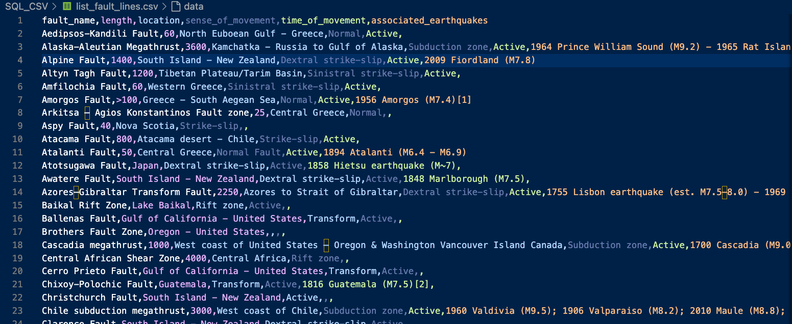

# Welcome to the SQL-CSV converter

## Task
The task is to bridge the gap between different data formats by converting data between SQL and CSV. This involves:
- SQL to CSV: Extracting data from an SQLite database and transforming it into a well-formatted CSV file
- CSV to SQL: Taking data from a CSV file and importing it into an SQLite database, dynamically creating the table if necessary
- Challenge: Ensuring compatibility with varying column names and handling data integrity between formats.
This project demonstrates the importance of data interoperability and showcases how to efficiently handle format conversions in Python.

## Description
To solve the problem, I created two core functions:
1. sql_to_csv: Connects to an SQLite database, retrieves data from a specified table, and converst it to a CSV format. The output is saved to a file for portability.
2. csv_to_sql: Reads an CSV file, extracts headers to define the table schema, and inserts the data into an SQLite database. If the table does not exist, it is created dynamically.

#### Key Features
- Dynamic Table creation: Automatically adapts to the structure of the CSV file during import
- Column sanitization: Handles special characters and spaces in column names to ensure SQLite compatibility
- File I/O: Saves outputs as .csv files and stores imported data in .db SQLite databases.

This project ensures seamles data translation while maintaining data integrity, providing a practical solution for scenarios involving SQL and CSV format exchanges.

## Installation
1. Clone the repository  
   `git clone https://github.com/aip956/SQL_CSV_Convert`  
   `cd SQL_CSV_Convert`

2. Set up a virtual environment (optional, but recommended) 
   `python3 -m venv venv` 
   `source venv/bin/activate` 
   `venv\Scripts\activate` #Windows 
3. Install dependencies 
   Python 3.6 or above
   (sqlite3, csv, and io are part of Python standard library modules)
   
## Usage
#### Running the script
1. Place input files in the working directory
   1. all_fault_line.db for the SQL-to-CSV task
   2. list_volcano.csv for the CSV-to-SQL task
2. Run the script
   `python3 my_ds_babel.py`
3. Check the output
    - list_volcanoes.db: Contains the SQLite database populated from list_volcano.csv
    - list_fault_lines.csv: Another CSV file generated as part of the final task
      - Screen capture of the csv:
      
        
 

